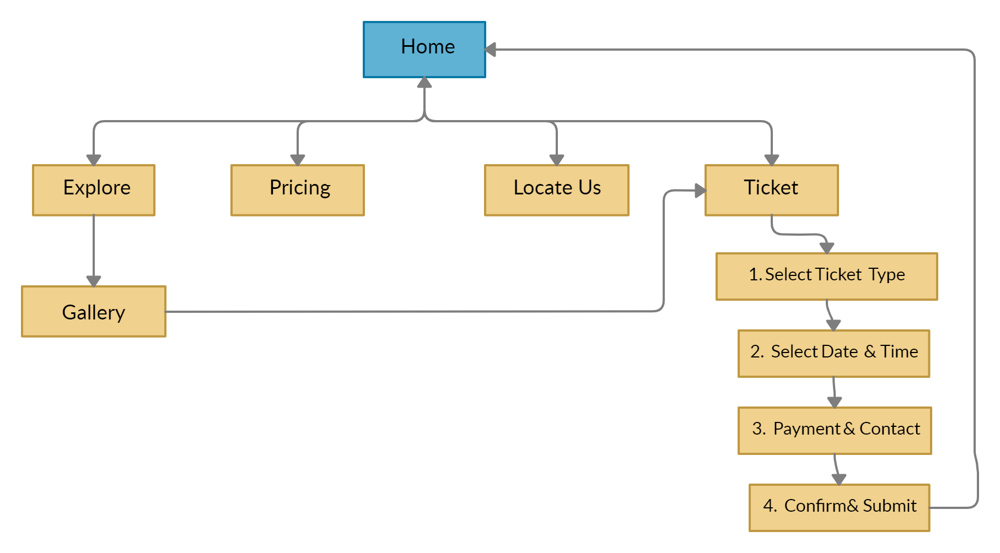
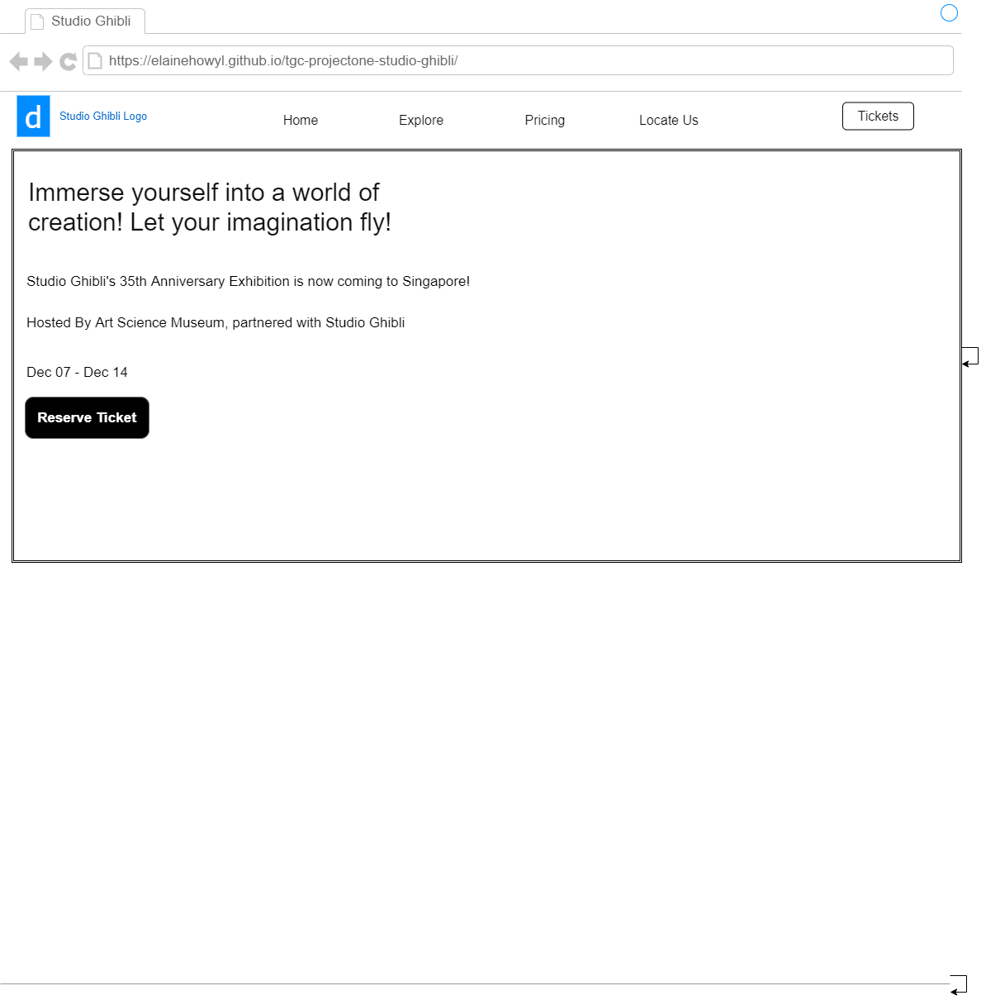

# TGC PROJECT ONE: STUDIO GHIBLI TICKET BOOKING 

## Introduction

This is a project where I create a ticketing platform for an exhibition that is hosted by both Art Science Museum and Studio Ghibli.

## Demo

A live demo of the website can be found here: 
[Demo](https://elainehowyl.github.io/tgc-projectone-studio-ghibli/)

## Strategy

### Identifying Users

#### Site Owner (Art Science Museum)

As a site owner, from the point of view as a staff from Art Science Museum, my primary goal of creating the website is to arouse public's awareness about the exhibition, promote ticket sales and also, to encourage local tourism.

Since the start of the year, the Coronavirus has stripped everyone off the right to travel freely across the globe. As a result of that, there has been a growing interest among Singaporeans to explore their home country. Local tourism has also been encouraged to help the recovery of the country's economy.

Art Science Museum would like to create a presence in the public's eyes with its first global collaboration with Studio Ghibli, a widely known animation studio around the world. This 

#### Client (Studio Ghibli)

The client of the website is whom Art Science Museum has collaborated with to put up the exhibition - Studio Ghibli. The goal of Studio Ghibli is to commemorate their 35th anniversary and along with their announcement of releasing still background images from their movies' scenes, to showcase their artwork.

#### User

The user of the website refers to the ticket buyer and the demographics are catered more towards teenagers, young people and families with children who might or might not be a fan of Studio Ghibli or simply, Japanese Animation.

The main goal of the user is to reserve ticket and find out more information about the exhibition itself. The reservation of the ticket should be simple and straight to the point. Informations about the exhibition such as the dates and price should also be within sight of the user's eyes.

#### User's Stories

* As a 

## Scope

### Features

#### Functional Requirement

* Reserve Ticket Button: Allows user to reserve ticket.
* Ticket Reservation Form: Will allow user to select ticket type, quantity, date and time, and inputting their payment and contact details.  
* Next Button in ticketing page: Will perform form validation - will not allow user to proceed to the next page if the required fields in the form are not filled up with the correct format.

#### Content Requirement

* Pricing Page: Allows user to view the details (price, activities) in different ticket type.
* Locate-Us Page: Allows user to view the location in the map with an address attached to it. Also allows user to check on the different ways of transportation to get to the museum.
* Explore Page: Allows user to access the sneak preview of the still background images provided by Studio Ghibli.
* Confirm and Submit Page after selecting tickets: User can review their selection and contact/payment details before submitting the form, thus allowing them to amend the choices if there is any mistake.

#### Non Functional Requirement
* Website is mobile-responsive to medium-sized phones, tablets and laptops.

## Structure 

The homepage acts as a base where all the other pages would branch out from. Besides the navigation bar, the ticketing page is also linked from the homepage and the gallery page to facilitate convenience of booking a ticket.
      
## Skeleton

## Design and Color Scheme

## Acknowledgement

### Layout
* Navigation bar, jumbotron, collapse bar and cards from:
[BootStrap](https://getbootstrap.com/)

### API
* Studio Ghibli restful API by: [GhibliAPI] (https://ghibliapi.herokuapp.com/)

### Images
* Background Images from Homepage, Explore Page, posters and still background images from Gallery page by:
[StudioGhibli] (https://www.ghibli.jp/info/013381/)

* Background Image of Pricing Page by JULIO NERY from Pexels:
https://www.pexels.com/photo/paintings-in-side-room-1839919/

* Background Image of Locate Us Page by Hu Chen on Unsplash:
https://unsplash.com/photos/__cBlRzLSTg

### Logo

* Studio Ghibli Logo by:
[StudioGhibliAustralia](https://www.madmenstudios.sg/)

### Icons

* Transportation icons from Locate Us Page by:
[GoogleIcon](https://www.w3schools.com/icons/google_icons_intro.asp)

* Icons on the Ticket Page by:
[BootStrapIcon](https://icons.getbootstrap.com/)

### Map

* Map and marker by:
[Leaflet]https://leafletjs.com/

### Symbol
* Symbol for pricing page and back to top button by:
[i2symbol]http://www.i2symbol.com/symbols/arrows

