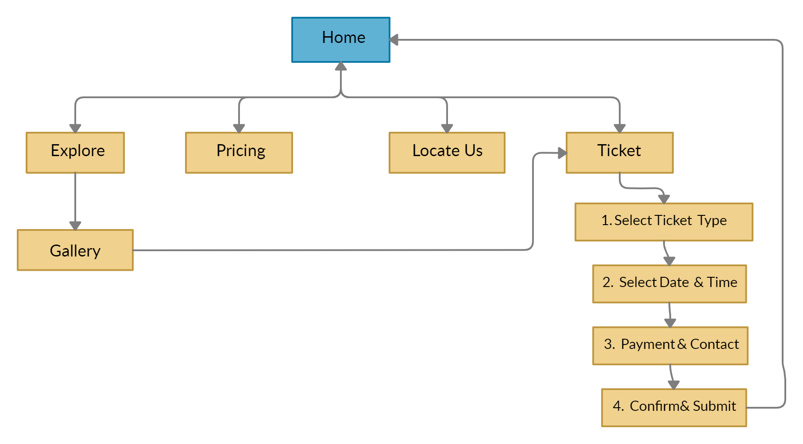
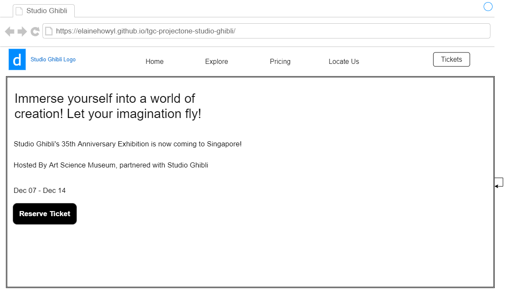
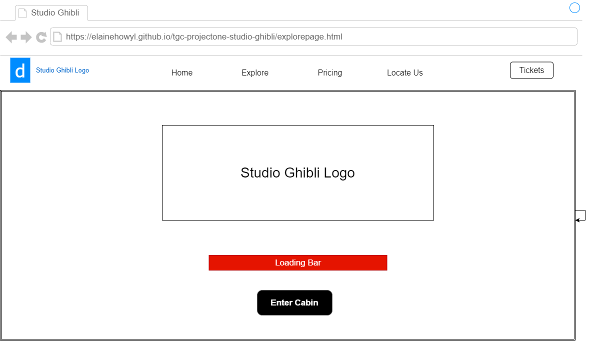
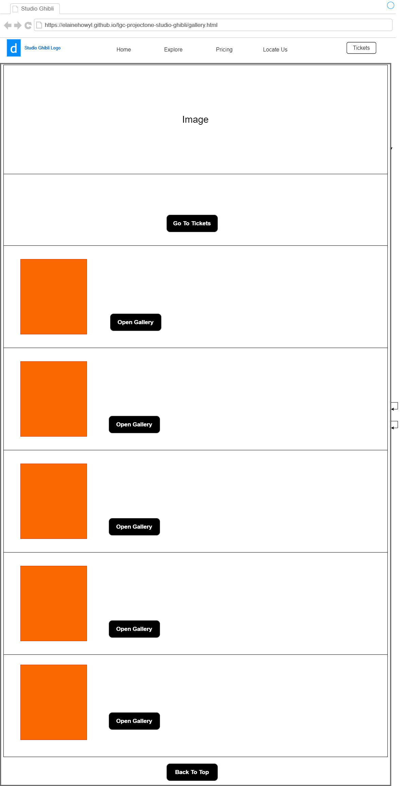
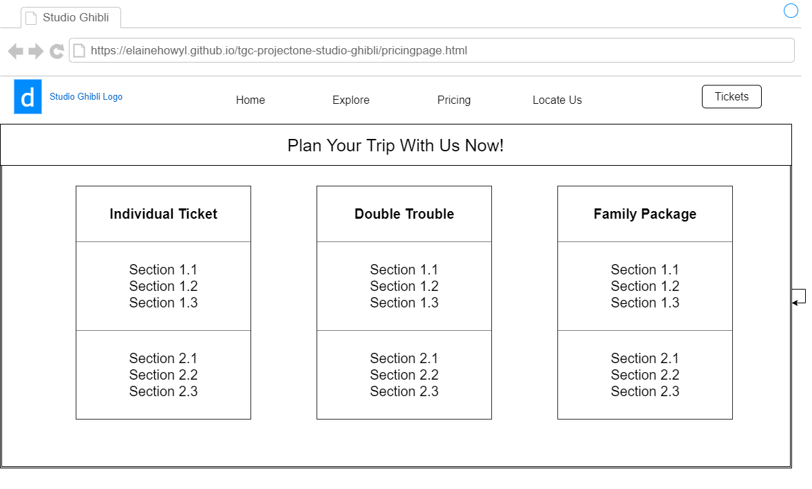
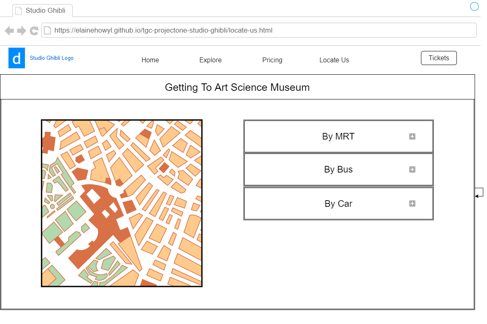
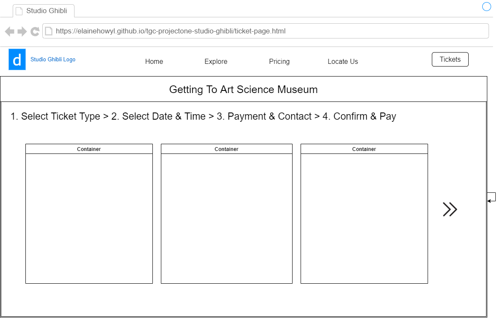

# TGC PROJECT ONE: STUDIO GHIBLI TICKET BOOKING 

## Introduction

This is a project where I am required to create a website with the knowledge of HTML, CSS and Javascript. The theme that I chose is a ticketing platform for an exhibition that is hosted by both Art Science Museum and Studio Ghibli. 

## Motivation

The motivation for this project came from implications of the current Covid-19 situation where people were stripped off their freedom to travel around the globe, which resulted in a growing interest among the locals to explore their home country.

The purpose of this website aims to help the museum to be a place of consideration when people thinks about local tourism.

## Demo

A live demo of the website can be found here: 
[Demo](https://elainehowyl.github.io/tgc-projectone-studio-ghibli/)

## Strategy

### Identifying Users

#### Site Owner (Art Science Museum)

As a site owner, from the point of view as a staff from Art Science Museum, my primary goal of creating the website is to arouse public's awareness about the exhibition, promote ticket sales and also, to encourage local tourism.

I would also like to take this opportunity to get people to know more about the future exhibitions the museum is going to have.

Art Science Museum would like to create a presence in the public's eyes with its first global collaboration with Studio Ghibli, a widely known animation studio around the world. This 

#### Client (Studio Ghibli)

The client of the website is whom Art Science Museum has collaborated with to put up the exhibition - Studio Ghibli. The goal of Studio Ghibli is to commemorate their 35th anniversary and along with their announcement of releasing still background images from their movies' scenes, to showcase their artwork.

#### User

The user of the website refers to the ticket buyer and the demographics are catered more towards teenagers, young people and families with children who might or might not be a fan of Studio Ghibli or simply, Japanese Animation.

The main goal of the user is to reserve ticket and find out more information about the exhibition itself. The reservation of the ticket should be simple and straight to the point. Informations about the exhibition such as the dates and price should also be within sight of the user's eyes.

#### User's Stories

* As a ticket buyer, I want to be able to

## Scope

### Functional Requirement

* Reserve Ticket Button: Allows user to reserve ticket.
* Ticket Reservation Form: Will allow user to select ticket type, quantity, date and time, and inputting their payment and contact details.  
* Next Button in ticketing page: Will perform form validation - will not allow user to proceed to the next page if the required fields in the form are not filled up with the correct format.
* Back to Top button in gallery page: Will instantly bring user back to the top of the page.
* Show Gallery button that will show all the background images retrieved from a local JSON file.

### Content Requirement

* Pricing Page: Allows user to view the details (price, activities) in different ticket type.
* Locate-Us Page: Allows user to view the location in the map with an address attached to it. Also allows user to check on the different ways of transportation to get to the museum.
* Explore Page: Allows user to access the sneak preview of the still background images provided by Studio Ghibli.
* Confirm and Submit Page after selecting tickets: User can review their selection and contact/payment details before submitting the form, thus allowing them to amend the choices if there is any mistake.

### Non Functional Requirement
* Website is mobile-responsive to medium-sized phones, tablets and laptops.
* The pages load quickly.

## Structure 

The website is based on more of a hierarchical structure where the homepage acts as a base. With the implementation of a navigation bar, the user would be able to navigate around different pages easily - explore, pricing, locate us and ticket page.

To facilitate the convnience of booking a ticket, besides the navigation bar, the ticketing page is also linked from the homepage and the gallery page.

All the pages can be found and accessed easily except for the gallery page where it is only available for access through the explore page.
      
## Skeleton and Layout

The layout of my website is pretty simplistic with just a navigation bar and a body. Each page is structered in a way that it is straight to the point in accordance with the page title.

* Homepage:

Features:
* A slide show that features background images from Studio Ghibli.
* A reserve ticket button.

* Explore Page:

Features:
* A mimicked loading page.
* An enter cabin button which leads to the gallery page.

* Gallery Page:

Features:
* An image of Studio Ghibli's producer, Toshio Suzuki.
* A section to introduce the exhibition.
* A reserve ticket button.
* Information about individual films.
* Back to Top button.

* Pricing Page:

Features:
* Three bootstraps card to display the different price package.

* Locate Us Page:

Features:
* A map.
* A set of 3 collapse buttons.

* Ticket Page:

Features:
* Checkboxes and dropdown button for the user to select ticket type and quantity.
* Radio button and dropdown button for the user to select only one date and one timing.
* A form for the user to fill in their payment and contact details.
* A confirm and submit page to allow user to review their selected choices and input.

## Design and Color Scheme

## Acknowledgement

### Layout
* Navigation bar, jumbotron, collapse bar and cards from:
[BootStrap](https://getbootstrap.com/)

### API
* Studio Ghibli restful API by: 
[GhibliAPI] (https://ghibliapi.herokuapp.com/)

### Images
* Background Images from Homepage, Explore Page, posters and still background images from Gallery page by:
[StudioGhibli] (https://www.ghibli.jp/info/013381/)

* Background Image of Pricing Page by JULIO NERY from Pexels:
https://www.pexels.com/photo/paintings-in-side-room-1839919/

* Background Image of Locate Us Page by Hu Chen on Unsplash:
https://unsplash.com/photos/__cBlRzLSTg

### Logo

* Studio Ghibli Logo by:
[StudioGhibliAustralia](https://www.madmenstudios.sg/)

### Icons

* Transportation icons from Locate Us Page by:
[GoogleIcon](https://www.w3schools.com/icons/google_icons_intro.asp)

* Icons on the Ticket Page by:
[BootStrapIcon](https://icons.getbootstrap.com/)

### Map

* Map and marker by:
[Leaflet](https://leafletjs.com/)

### Symbol
* Symbol for pricing page and back to top button by:
[i2symbol](http://www.i2symbol.com/symbols/arrows)

### Favicon
* Favicon from 
[Favicon.io](https://favicon.io/emoji-favicons/trident-emblem/)

